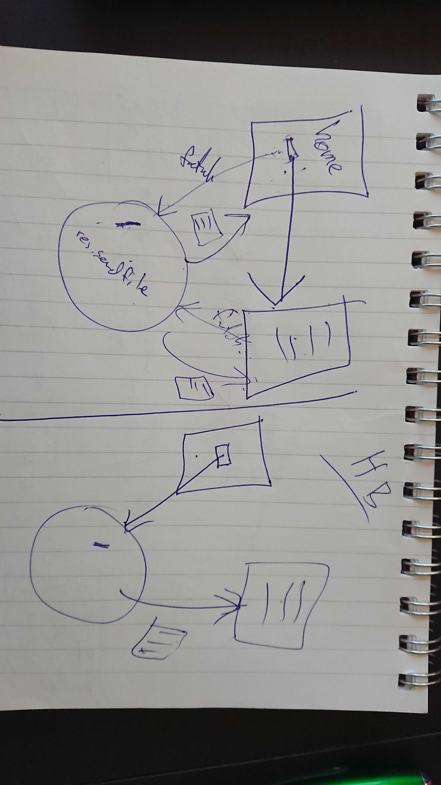

# Four-day project: Diario Semanal

## User Stories

*As a user, so I can read and write blog posts, I would like a website for this.  
*As a user, so I can write a blog, I want to be directed to a page where I can do so.  
*As a user, so I can decorate my blog, I want to be able to insert a GIF into my posts.  
*As a user, so I can read other people’s blogs as well as my own, I want to find them easily altogether on one page.  
*As a user, so I can express my thoughts on other people’s posts, I want to be able to comment on them.  
*As a user, so I can simply express my feelings on other people’s posts, I want to be able to select reaction emojis from a few choices.  
*As a user, so I can have a consistent user experience, I want to see the same content if I exit and reload the page.  
*As a user, I can visit the website and post a blog within a given word limit.  
*As a user, when I encounter an error I want to see an error page consistent in formatting as the rest of the website, as not to ruin my user experience.   
  
  
  
###### *Stretch (we would love to have these features, but they were not part of the mvp).*  
*As a user, I can sort blog entries by author.   
*As a user, I want to search for blog posts by keywords in their content.   
*As a user, I want to edit my existing blog posts.  
*As a user, I want to not be confused with another author of the same name.   

# Screenshots: 
###### homepage
 
###### new post
 
###### blog post
 

## Functionality:  
-When they click on a new post, take them to a new page to write a post.  
-Implementing a word count on the inputs (newPost and newComment).   
-Save data and send to JSON file.   
-API calls to Giphy and loading GIF into a post.  
-Write and view comments.  
-Emoji reacts, similar to FB format.     
-Responsive webpage -> Breakpoints (Phone, Tablet, PC, XL screen).  

# Technologies
- Templating -> Handlebars
- Node/ Express + JSON
- GitHub Desktop for version control
- Commit messages in present tense -> Industry standard
- VSCode
- Google Docs for keeping track of progress and meeting notes. 

## Team routine
- Stand-ups at 9:15.  
- We commit in the present tense.   
- We review and resolve issues as they come up.   
- Retros at 5
- We have chocolate and sweets to motivate us
- Driver - Navigator, 30 min code rotation, 10 min break per change in between
- BEM for naming CSS classes
- Refactoring and commenting code at the end of the day

# Day 1 Retro
## Achieved a lot
- Basic routing set up
- JSON write and read is functional
- Setup basic HTML, CSS, file structure
## Problems we faced
- Couldn’t search the JSON array of blog posts but used Array.find()
- We had functions in the wrong files! And had to move them around so they linked to the right HTML pages.
- Struggling to build JSON structure as we didn’t know the syntax - researched and fixed
- We tried to do 3 steps in 1 with the routes and ended up doing it in 3 instead
- Extract data from form
- Write said data to JSON
- Then render file with said data displayed as new blog entry
- Working with fs.writeFile and fs.readFile - got around async problems by nesting write inside read
- Tried to refactor and separate our code into different files
- Ran into problems with import and export syntax
- Solved that but couldn’t pass global variables between the files

# Day 2 Retro 

- Insert blog data from JSON into blogPost.html
- Fetch full JSON body to fill home page grid/flexbox/display
- Implement comment functionality
- Implement GIF functionality (using giphy API)
- Put gifs on JSON
- Give new variable to blogPost to connect all of the gifs
- Implement emoji functionality
- Add Giphy attribution
- Add alt attributes for images
## Problems we faced:
- Running routes twice
- Tried to make a dynamic webpage by injecting information through front-end javascript

 ## Solution: 
- Redirected it to render the original page the comments were made on.
- Could render new comments once it was submitted but not a second time 
- Solution: Nodemon restarts server due to changes but it works on node (happened again on day 3)
- Solved dynamic webpage issue by using handlebars. 

# Day 3 Retro
## Problems and solutions:
- Using an image for the emojis and struggled to change the value because the value was what was displayed so we changed the input:submit to a button:submit which had a separate display and value. We needed this when goign throug hthe body to check what was clicked and then increment the correct counter in the JSON file.  
- We wanted to update the JSON file and also update the page at the same time with the emoji count but this didn’t work until we changed the click event on the button to an on(“click”) event. So on submit, it goes to app.post/emoji and returns 204 status which means it stays on the same page, then it runs the on(“click”) event and updates the DOM of the HTML
- Trouble while refactoring --> storing our code in another file and accessing it through app.js 

# Day 4 Retro 
## What we achieved: 
- CSS formatting for all our pages 
- Moving JSON read/write funcitonality from app.js to separate js file
## Problems 
- Could not extract a JSON read functionality into its own function as we have done for write
- Could not locate css files through handlebars 
- Could not get around global variable storage method

# Day 5 Retro 
## What we achieved 
- Comment code / prep for code review
- Breakpoints
- Refactor duplicate CSS
- Presentation
- Fix user stories
- Format / shorten dates on home page and in posts
- Nice to have: add ::selection {...} and textarea { resize: none; }
- Add CSS to error page

